

# Dev_Setup
Setup Development Environment

#Assignment: Setting Up Your Developer Environment

#Objective:
This assignment aims to familiarize you with the tools and configurations necessary to set up an efficient developer environment for software engineering projects. Completing this assignment will give you the skills required to set up a robust and productive workspace conducive to coding, debugging, version control, and collaboration.

#Tasks:

1. Select Your Operating System (OS):

 Download and Install Windows 10. https://www.microsoft.com/software-download/windows10

2. Install a Text Editor or Integrated Development Environment (IDE):
   Select and install a text editor or IDE suitable for your programming languages and workflow.

   - i choose the visual code code because of its user interface and to download it go to https://code.visualstudio.com/download

3. Set Up Version Control System:

   Install Git and configure it on your local machine. Create a GitHub account for hosting your repositories. Initialize a Git repository for your project and make your first commit. https://github.com 

GitHub:Git

Steps:

1. Install Git
    -windows:downloaded the Git installer from git.scm.com and follewed installatin instructions

2. Configure Git:git config --globaluser.name 'your name" git config --globaluser.emal

3. Create a GitHub account : 
- visit the GitHub sing-up page
- Agree to the Terms of Service
- Verify your email address
4. Initialize a new repository run this command  git init
   then use gi add .  to stage your your files for commit 
   then commit your changes with git commit -m "describe your cmmit"

4. Install Necessary Programming Languages and Runtimes:
 1. Installed from hhtps//python.org/downloads/. and installed their respective compilers, interpreters, or runtimes using the same website.
 2. i have pip to build and execute my code.

5. Install Package Managers: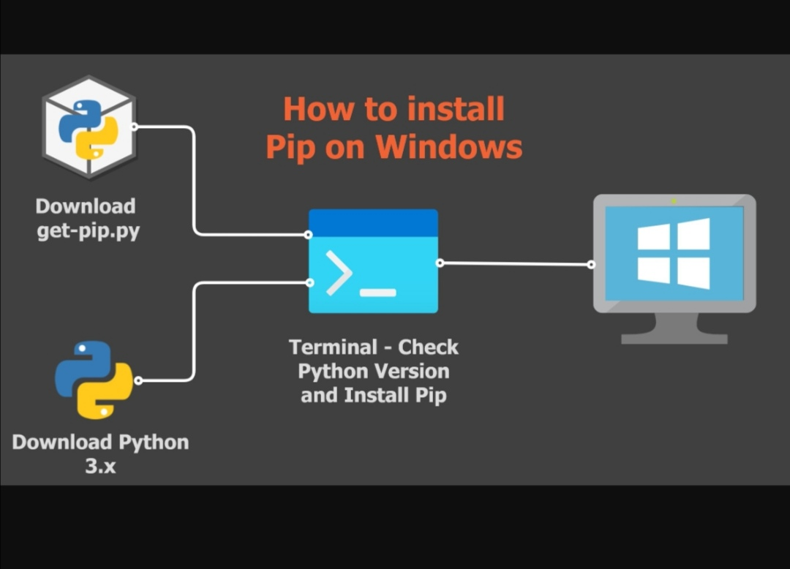

6. Configure a Database (MySQL):
   To download MYSQL installer go to http://dev.mysql.com/downloads/installer/. and double click on the MYSQL Installer fie and follow the steps bellow

   STEP 1:choosing a setup type 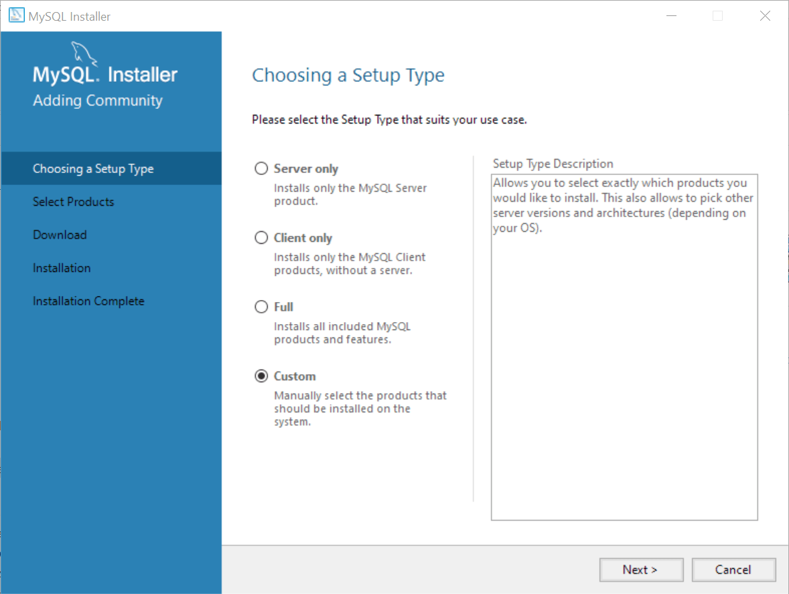
   STEP 2:selecting products 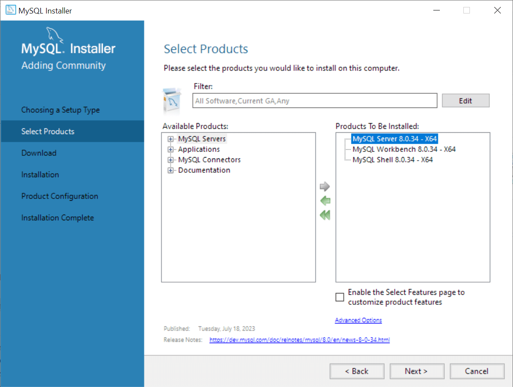
   STEP 3:downloading the selected products 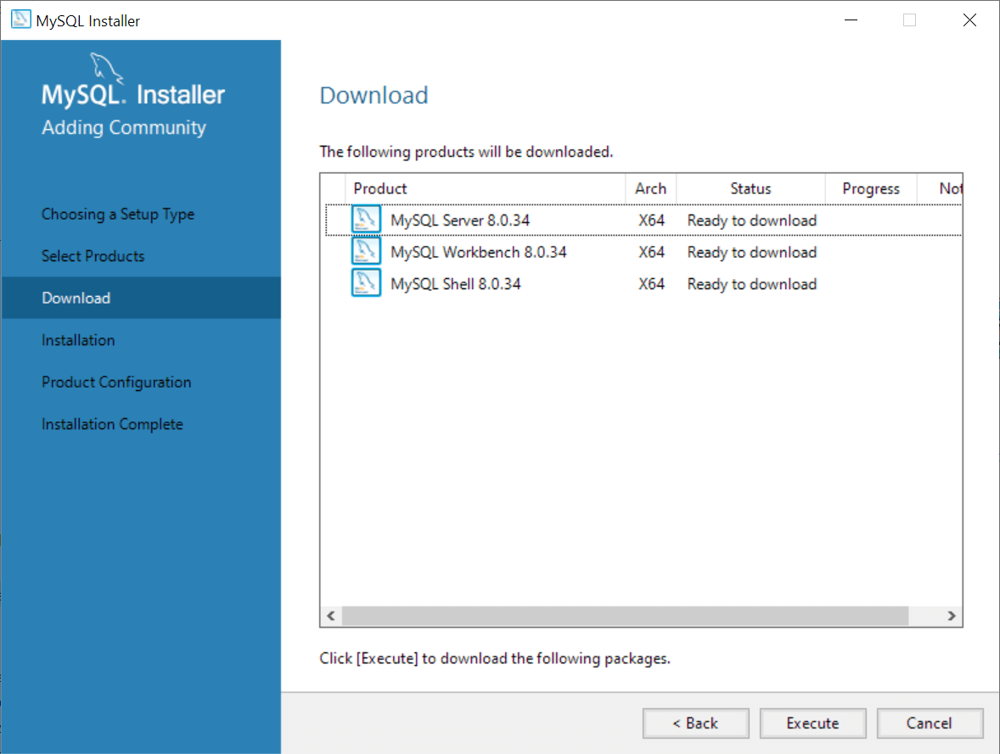
   STEP 4:installing the selected products 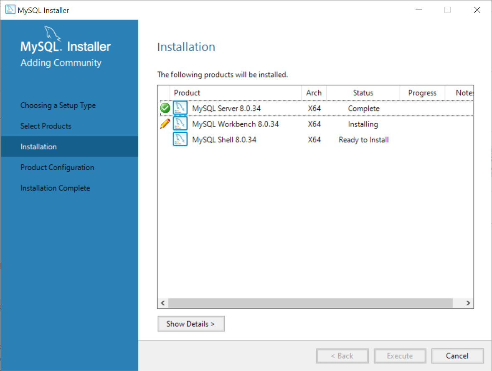
   STEP 5:configuring the MYSQL Sever 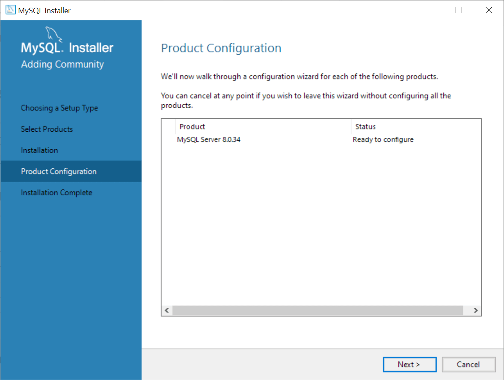 in this step only choose the delvelopment computer for the sever configuration type and leave other options as they are then click next
   STEP 6:choosing an authentication method 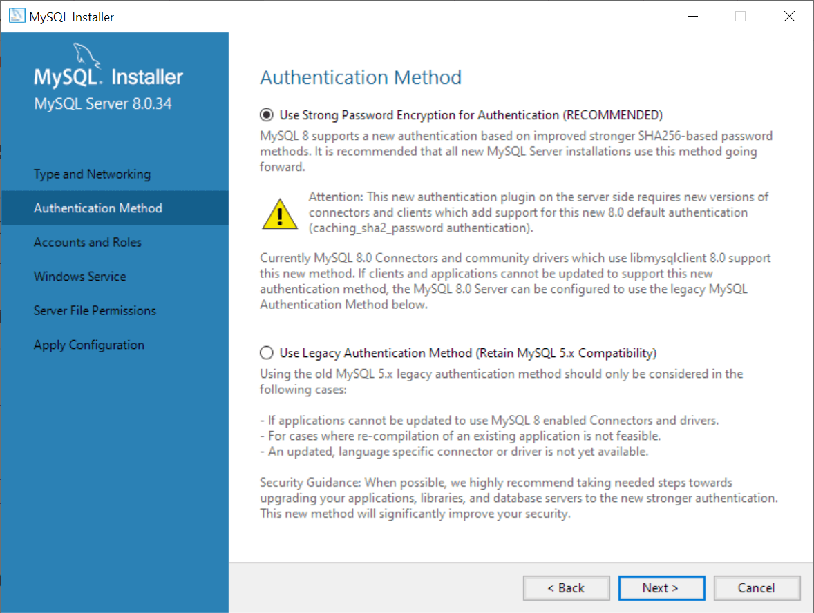
   STEP 7:entering password for the root account 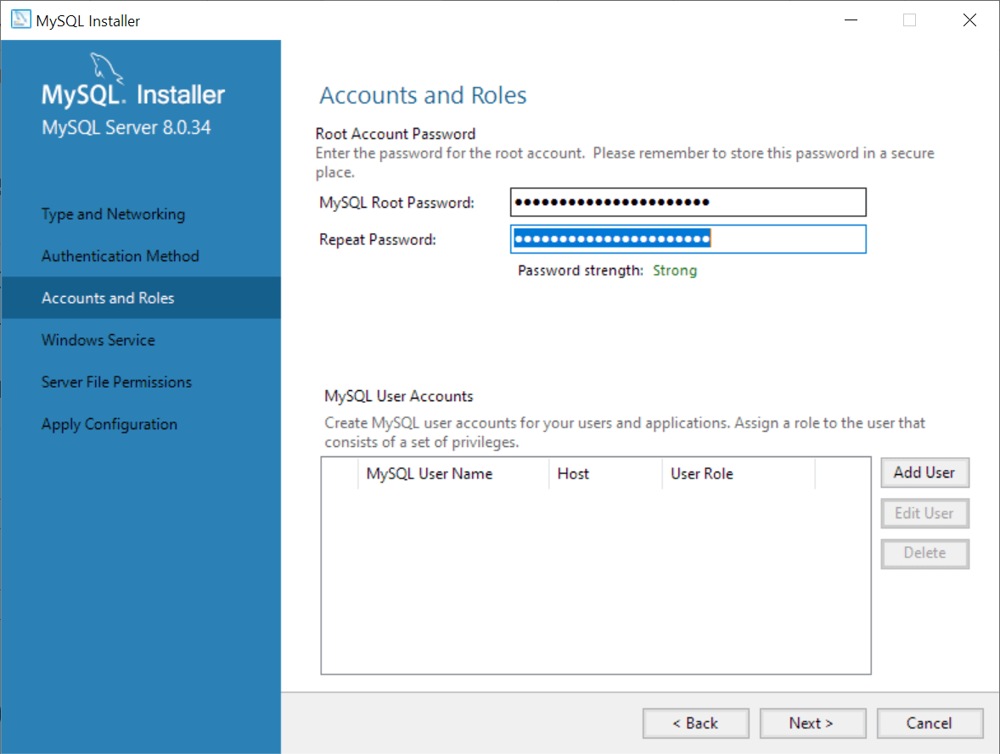
   STEP 8:configuring MYSQL sever as a window service 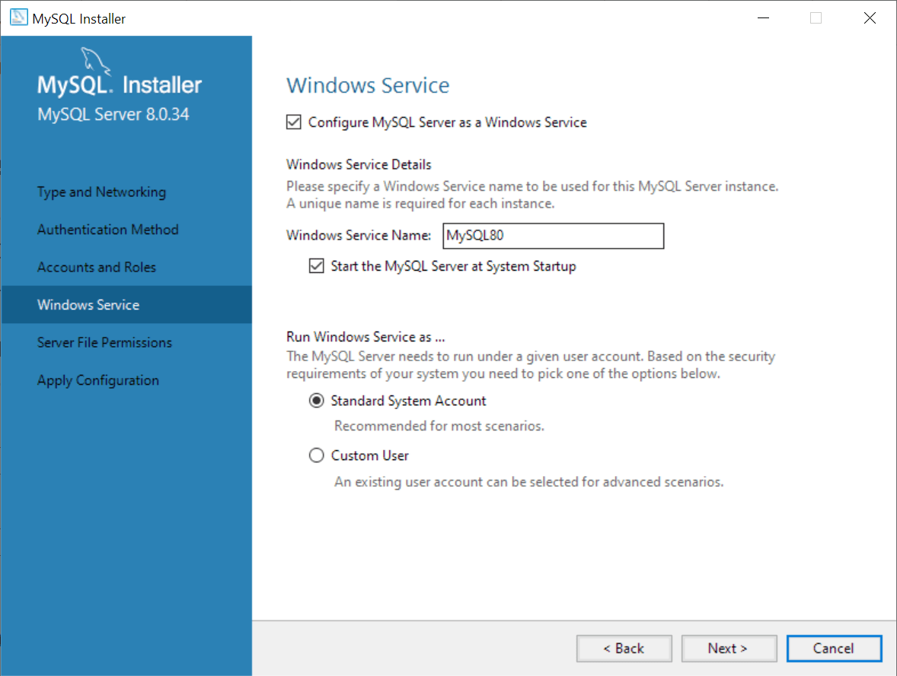
   STEP 9:granting file permissions 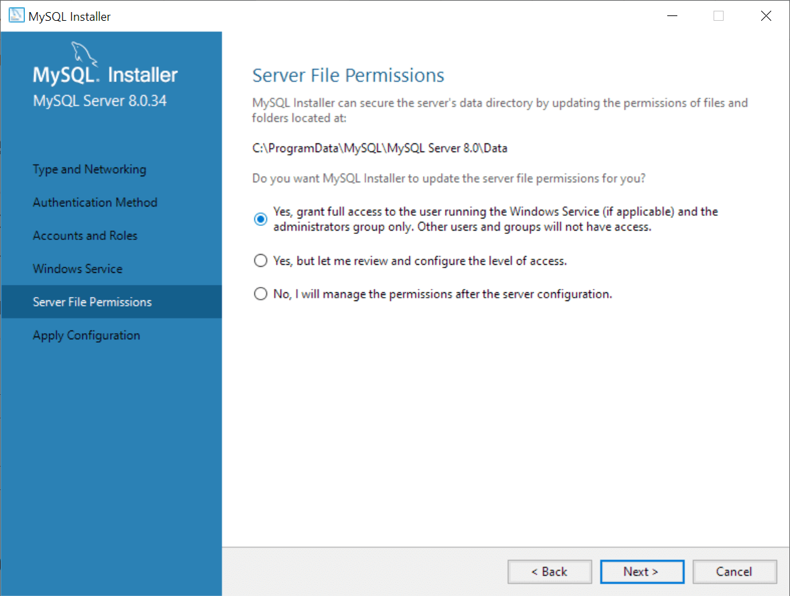
   STEP 10:displaying the selected configuration 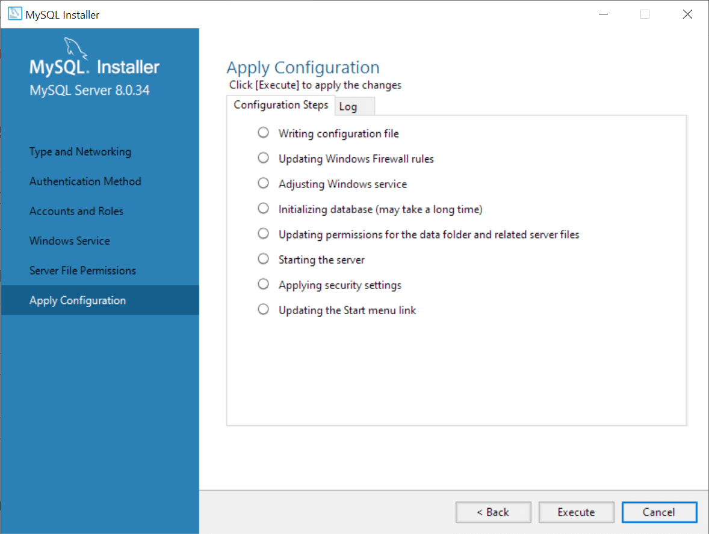
   STEP 11:completing configuration 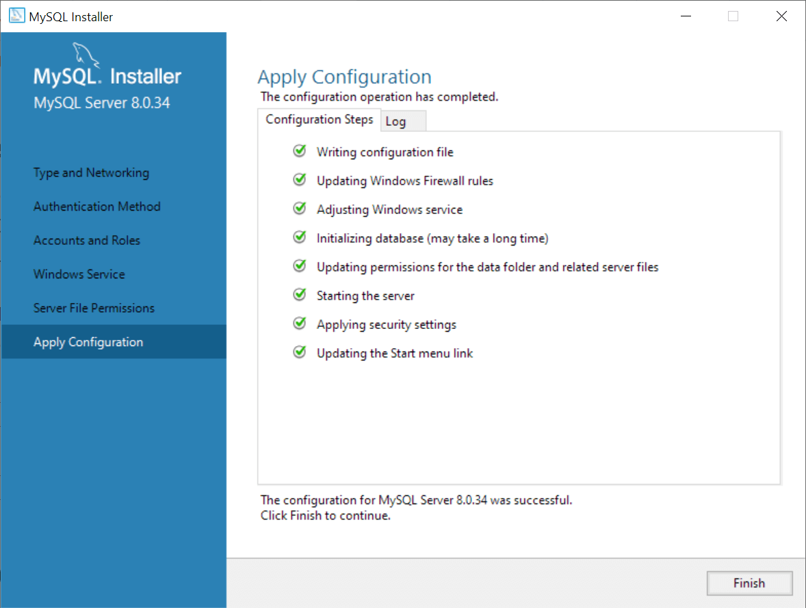
   after completing configuration click next to confirm and finish
   STEP 12:completing installation 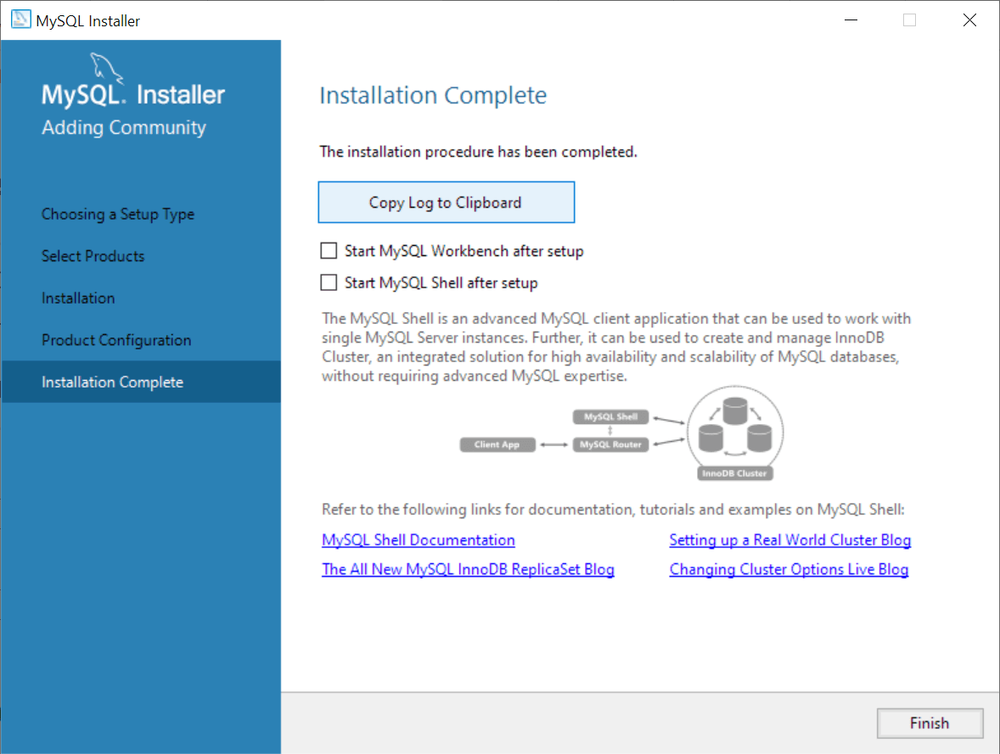 click the finish button to close the installer

7. Set Up Development Environments and Virtualization (Optional):
 I have vertualenv environment set up

8. Explore Extensions and Plugins:
   

   1. GitHub Copilot - it is an Ai powered code suggestions that can write code based on natural language comments
   2. ChatGPT - it is text based Ai tool to answer your codinng questions
   3.Settings Sync - synchronize vscode settings across devices,you can sync these settings to your GitHub account which makes it easy to access them on any device
   4. GitLens - views inline git annotations,commute graphs and more
   5.TODO Highlights- higlits TODO comments within your code 
   6. Better Comments - enhances code comments with colors and formatting
   7. Markdown All In One - intergrated markdown support in vscode

9. Document Your Setup:
    Create a comprehensive document outlining the steps you've taken to set up your developer environment. Include any configurations, customizations, or troubleshooting steps encountered during the process. 

How to install virtual environment uisng venv:

STEP 1:you can install venv to your host python by running a this command " pip install virtualenv " in your terminal  
Step 2: onces installed you can create a virtual environmrnt with " virtualenv directory "
by having many pythons installed whicg caused conflits i made sure to use the correct python interpreter then tried running py -m venv venv. 

- A GitHub repository containing a sample project initialized with Git and any necessary configuration files (e.g., .gitignore).https://github.com/NeoMonametsi/djangoproject/tree/main/my_project

#Submission:
Submit your document and GitHub repository link through the designated platform or email to the instructor by the specified deadline.

#Evaluation Criteria:**
- Completeness and accuracy of setup documentation.
- Effectiveness of version control implementation.
- Appropriateness of tools selected for the project requirements.
- Clarity of reflection on challenges and solutions encountered.
- Adherence to submission guidelines and deadlines.

Note: Feel free to reach out for clarification or assistance with any aspect of the assignment.
